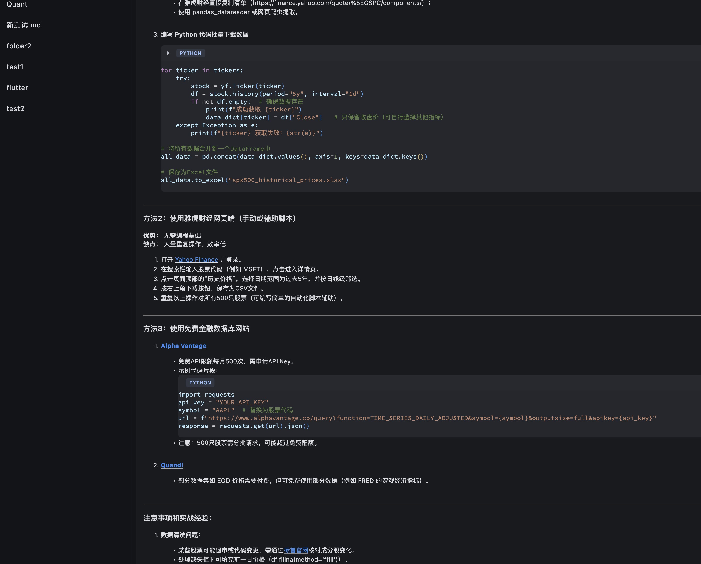

# MagicAI (中文版)




**希望可以在AIoT时代做点什么的开源智能体界面框架**

[](https://flutter.dev)
[](LICENSE)
[](CONTRIBUTING.md)

## 项目初衷
看到Deepseek 的开源，作为个人开发者考虑能否用自己擅长的方式为行业做点力所能及的事。我一直对 “AI + 物联网” 的融合方向感兴趣，尤其看好边缘计算的潜力。为了应对未来可能遇到的跨平台交互需求，我决定学习一门新的技术栈。在 TypeScript 与 Flutter 之间，我选择了相对小众但性能更贴近原生的 Flutter。过去一个月一边学习框架一边开发，逐步搭建了当前的基础架构。未来计划聚焦两个方向：构建可复用的组件库，并探索轻量级边缘计算的实现方案。希望通过这个开源项目，与大牛们共同探索 AIoT 时代的可能性。


## 🚀 当前状态
**早期开发阶段** (v0.1-alpha)  
⚠️ 尚未可用 - 正在积极开发中  
- 当前的期望是可以在未来的1-2周内实现基本的交互功能。
- 当前功能尚不稳定，尤其是存储格式极有可能随时调整。

/Users/Yourname/Library/Containers/com.example.magicai/Data/Library/Application Support/com.example.magicai/data.json

## ✨ 核心特性
### 1. 智能体管理器
- 灵活的智能体生命周期管理
- 跨设备同步机制
- 插件系统架构

### 2. Markdown对话存储
- 原生Markdown对话存储
- 版本控制的对话历史
- 便携式对话格式

### 3. 模块化设计
- 独立功能组件
- 热插拔功能模块
- 解耦式架构

## 🛠️ 快速开始
```bash
# 克隆仓库
git clone https://github.com/may-liu/MagicAI.git

# 安装依赖
flutter pub get

# 运行开发版本
flutter run -d macos
或者
flutter run -d windows
或者
flutter run -d apk
```

## 📄 开源协议
本项目采用MIT协议 - 详见[LICENSE](LICENSE)文件。
